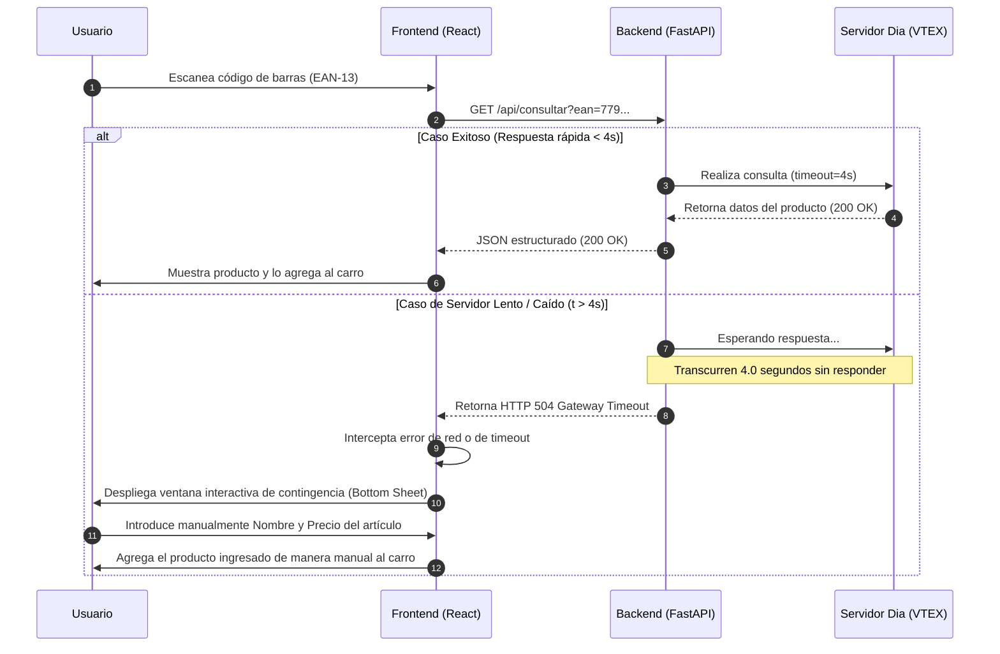
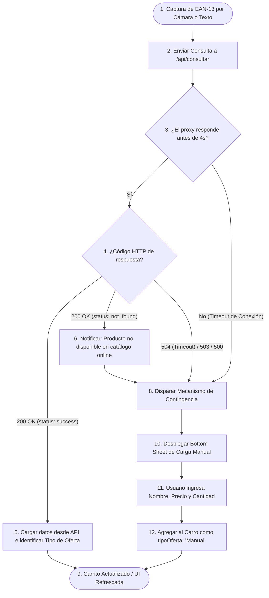

# Manual Técnico

Este documento detalla la arquitectura, diagramas de flujo de datos, estructuras de datos, especificaciones de la API y lógica de contingencia de la aplicación **App Carro Dia Argentina** (Chango Supermercado).

---

## 1. Arquitectura General del Sistema

La aplicación sigue una arquitectura cliente-servidor adaptada para entornos híbridos móviles y de red local. Está compuesta por dos componentes principales:

1.  **Frontend (React 19 + Vite 8 + Tailwind CSS 3/4 + Capacitor)**:
    *   Una aplicación web de página única (SPA) optimizada para dispositivos móviles mediante Tailwind CSS y empaquetada como una app nativa de Android a través de **Capacitor**.
    *   Gestiona el escaneo del código de barras a través de la cámara del dispositivo móvil, mantiene el estado global del carrito de compras en el `LocalStorage` del navegador/webview, y realiza las peticiones asíncronas hacia el backend.
    
2.  **Backend Proxy Scraper (FastAPI + Python)**:
    *   Un servidor local ligero desarrollado con FastAPI que actúa como intermediario (proxy) entre el frontend y las APIs públicas de Supermercados Dia.
    *   **¿Por qué es necesario el Proxy?**:
        1.  **Evasión de CORS**: Evita las restricciones de seguridad que aplican los navegadores/webviews al consultar dominios externos directamente desde scripts JS.
        2.  **Modificación de Encabezados (Spoofing)**: Configura encabezados HTTP idénticos a los de un navegador estándar (`User-Agent`, `Accept-Language`) para evitar bloqueos por parte del firewall de la API externa.
        3.  **Simplificación y Limpieza de Payload**: Las APIs de la plataforma VTEX de Supermercados Dia retornan estructuras JSON sumamente complejas y anidadas. El proxy extrae únicamente los campos necesarios y genera una respuesta limpia y compacta.
        4.  **Control Fino de Tiempos de Espera (Timeout de 4s)**: Define una restricción estricta de tiempo para evitar bloqueos prolongados en el hilo del cliente.

```mermaid
graph TD
    User([Usuario con Celular]) <--> |Escaneo de Góndolas| Front[Frontend React + Capacitor]
    Front <--> |Peticiones HTTP Locales (Puerto 8000)| Proxy[Backend Proxy FastAPI]
    Proxy <--> |HTTPS Requests (User-Agent spoofing)| DiaAPI[API Tienda Online Dia Argentina]
    
    subgraph Dispositivo Móvil / Red Local
        Front
        Proxy
    end
```

---

## 2. Especificación de la API (Backend Proxy)

El servidor expone un único endpoint de consulta que interactúa con los servicios de catálogo de Supermercados Dia.

### Endpoint: Consultar Producto
*   **Ruta**: `/api/consultar`
*   **Método**: `GET`
*   **Parámetros de Consulta**:
    *   `ean` (string, requerido): El código EAN-13 del producto a consultar. Longitud mínima de 1 y máxima de 13 caracteres.

#### Respuestas Posibles

##### 1. Respuesta Exitosa (200 OK) - Producto Encontrado
Retorna los datos principales del producto limpios y aplanados.
*   **Código HTTP**: `200`
*   **Cuerpo (JSON)**:
```json
{
  "status": "success",
  "ean": "7790895000827",
  "name": "Aceite de Girasol Dia 1.5 L",
  "listPrice": 2500.0,
  "price": 2100.0,
  "ofertaActiva": true,
  "tipoOferta": "Club Dia",
  "imageUrl": "https://diaonline.supermercadosdia.com.ar/arquivos/ids/156789/aceite.jpg"
}
```

##### 2. Respuesta Exitosa (200 OK) - Producto No Encontrado
El servidor de Dia responde correctamente, pero el código consultado no tiene un producto activo asociado en el catálogo online.
*   **Código HTTP**: `200`
*   **Cuerpo (JSON)**:
```json
{
  "status": "not_found",
  "message": "Producto no encontrado en la tienda online de Dia."
}
```

##### 3. Tiempo de Espera Agotado (504 Gateway Timeout)
El servidor remoto de Dia tarda más de 4 segundos en responder a la petición HTTP del proxy. El proxy interrumpe la conexión y notifica al cliente.
*   **Código HTTP**: `504`
*   **Cuerpo (JSON)**:
```json
{
  "detail": "Tiempo de espera agotado (4s) al conectar con Dia."
}
```

##### 4. Error de Red / Servicio No Disponible (503 Service Unavailable)
Fallo físico de conexión a internet o rechazo del servidor remoto.
*   **Código HTTP**: `503`
*   **Cuerpo (JSON)**:
```json
{
  "detail": "Error de red: [Motivo detallado]"
}
```

---

## 3. Estructuras de Datos

### 3.1. Estructura del Código de Barras EAN-13
El código EAN (European Article Number) de 13 dígitos es la base de la identificación de productos en la aplicación:
*   **Prefijo del País (dígitos 1-3)**: `779` para la República Argentina.
*   **Código de la Empresa (dígitos 4-7 u 8)**: Asignado por GS1 Argentina al fabricante/dueño de la marca.
*   **Código del Artículo (dígitos 8-12 o 9-12)**: Código correlativo interno de la empresa para el producto específico.
*   **Dígito de Control (dígito 13)**: Calculado aritméticamente mediante la suma ponderada de los primeros 12 dígitos, garantizando la validez de la lectura del escáner.

### 3.2. Objeto Item del Carrito de Compras (Frontend)
El estado de la aplicación mantiene un array de productos agregados al carro. Cada ítem tiene la siguiente interfaz de datos:

| Campo | Tipo | Descripción | Ejemplo |
| :--- | :--- | :--- | :--- |
| `ean` | `string` | Código de barras único EAN-13 del producto. | `"7791234567890"` |
| `name` | `string` | Nombre descriptivo del producto. | `"Arroz Largo Fino Dia 1kg"` |
| `price` | `number` | Precio unitario final a cobrar en caja (con descuento si aplica). | `1250.00` |
| `listPrice` | `number` | Precio unitario de lista original (precio base sin promociones). | `1500.00` |
| `ofertaActiva` | `boolean` | Flag que indica si el producto goza de un descuento. | `true` |
| `tipoOferta` | `string` | Categorización de la promoción (`Directa`, `Club Dia`, `Por Cantidad`, `Manual`). | `"Club Dia"` |
| `quantity` | `number` | Cantidad física de unidades del producto añadidas al chango. | `2` |
| `imageUrl` | `string` | URL absoluta de la miniatura de imagen del producto. | `"https://diaonline.../img.jpg"` |

---

## 4. Lógica de Red y Flujo de Contingencia

La aplicación móvil opera en un entorno propenso a interrupciones y baja señal (el interior de los locales de supermercados). Para evitar que la aplicación se congele o frustre al usuario, se implementa una lógica de contingencia estricta controlada por un **límite de tiempo de 4 segundos**.

### Diagrama de Interacciones y Conectividad
Este diagrama de secuencia ilustra las diferentes respuestas que puede experimentar la aplicación frente a una consulta.



### Diagrama de Flujo del Límite de Espera de Red y Carga Manual
Este flujo lógico determina los pasos seguidos por el sistema para decidir si se agregan los datos automáticamente o se deriva a la interfaz de carga manual de contingencia.


